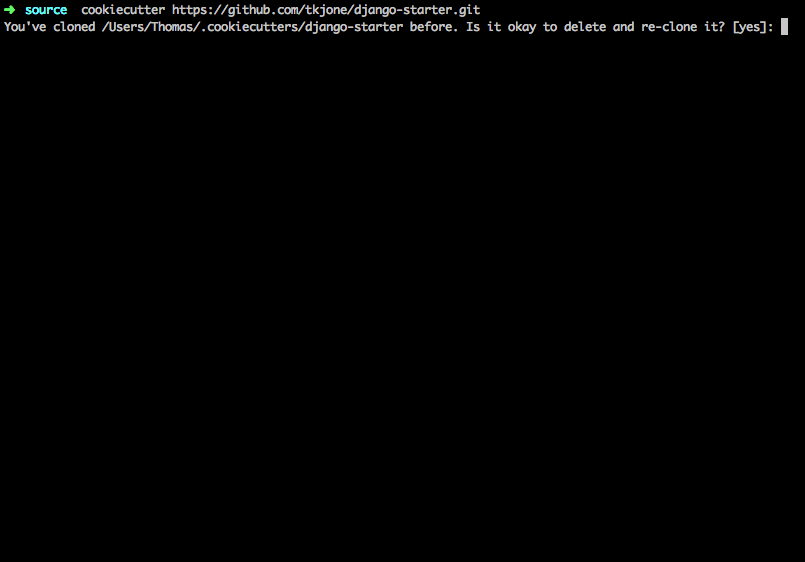

*******************
Wagtail Starter Kit
*******************

Welcome to Wagtail Starter Kit, a cookiecutter template for Django Wagtail Projects.

**NOTE:**

This is under active development. The current build should be stable.  Please note that this version is meant to be part of a monorepo pattern of project architecure.
If you are looking for something more comprehensive, please see the `dockerized` branch.

Overview
========

Wagtail Starter Kit provides you with a flexible starting point for your Django wagtail project.  Included in this template is a Django/Wagtail development environment provided by vagrant, a project layout inspired by pydanny's `cookiecutter django`_ and `Two Scoops of Django`_ and a lean set of dependencies.  The goal is to provide you with everything you need to quickly and easily start a new Django Wagtail project.

Wagtail Starter Kit uses a scaffolding tool called `cookiecutter`_.  Cookiecutter is similar to `Yeoman`_.  These tools are used to automatically build out entire projects instead of you having to create files manually and modify their configurations.

.. _cookiecutter django: https://github.com/pydanny/cookiecutter-django
.. _Two Scoops of Django: https://www.twoscoopspress.com/products/two-scoops-of-django-1-8
.. _Yeoman: http://yeoman.io/
.. _cookiecutter: https://cookiecutter.readthedocs.org/en/latest/index.html

Quick Start
===========

1. Install Cookiecutter
-----------------------

* OSX
   .. code-block:: bash

       brew install cookiecutter

* Linux + Windows
   .. code-block:: bash

       pip install cookiecutter

2. Build your Django project based on wagtail starter kit
---------------------------------------------------------

   .. code-block:: bash

       cookiecutter https://github.com/tkjone/wagtail-starter-kit.git

You are going to be prompted to answer some questions about your project and the answers you provide will be used to build and configure your new Django Wagtail project.  These questions are called `prompts`.  If you leave a `prompt` blank, Cookiecutter will use the default answer in the square brackets.  For a list of the prompts used by this template, please see the `prompts documentation`_

For example, let us pretend your a huge fan of Taye Diggs and you want to make a website celebrating his life.  This is how that would look:

Out of the Box
==============

The `wagtail starter kit` provides you with the following feature set:

* Django 1.10.x

* Wagtail 1.8.x

* Docker development environment

    Run this app within a docker container.

* Docker Provisioned

    Scripts to setup your environment automatically

* Python 3.6

    Standardized on python 3.6

* 12 Factor App

    Project is inspired by `12 factor app`_ which means it comes configured to use environment variables, database connection strings and other methodologies outlined in the 12 Factor manifesto.  Each one has defaults, which means you don't have to setup a `.env` or export variables to start development work.

* Postgres Everywhere

    Postgres 9.5

* Django Test/Development tools

    * pytest
    * pytest-cov
    * pytest-sugar
    * django-debug-toolbar

* Collaboration - dotfiles and documentation structure

    Documentation is important, wagtail-starter-kit provides you with a basic documentation structure.

.. _12 factor app: http://12factor.net/

Branches
========

This section is going to outline and provide context to the ``eternal`` branches in this repo.

I do not consider my descriptions and approaches outlined below to be the one true way, just the best that I know how at this moment.  Thus,  I apologize in advance for any generalizations I make as when it comes to how to structure a project, it is a very personal thing.

With this in mind, there are three main approaches to app architecture:

1.  **Monolithic:**  This is the idea that the whole app is composed as one piece of software.  It is developed and deployed as one piece.

2. **Monopurpose:**  This would be the idea of a micro service architecture.  Your app is divided into multiple isolated repos that talk to one another.

3. **Monorepo:**  This combines 1 + 2.  The idea is that you create separate services that live entirely on their own, but instead of living in separate repos, you put them all in one repo - like the monolithic, just clearer distinctions of functionality and purpose.

As I mentioned, there are many who will argue that my descriptions above are too generic and not reflective of the reality of each architecture.  This is understood. However, with the above in mind, we can now start to understand the different `eternal` branches.

v1.0
----

- Wagtail App
- React Front End
- vagrant development environment

This is the ``monolithic`` architecture and represents my approach to developing about a year ago (wrote this in January of 2017)

I started to move away from this because I wanted a greater separation of the front and the backend.

At this point, v1.0 is for posterity.

master
------

- Wagtail App
- vagrant development environment

This is the ``monopurpose`` architecture.  The Wagtail App are kept latest and the Front End has been removed.  This means that this can act solely as a service for an app and the front end is separated.

This branch will be the default as I believe this is a more common approach to developing and easier to understand.

dockerized
----------

- Wagtail App
- Docker development environment

This is the ``monopurpose`` architecture again, except dockerized.
This branch will be kept up to date regarding the dependencies

dockerized-monorepo
-------------------

- Wagtail App
- Docker development environment

This is the ``monorepo`` architecture.  Everything regarding the app is the same as ``master`` and ``dockerized``.  The difference is that I have removed the ``git``, ``docker-compose`` and a few other code quality files.
This has been done because now we can pop those into a monorepo and it is ready to go as an isolated app, but does not have the extras needed to be a repo on its own.

Constraints
===========

* Docker setup tested on OSX

    Project has not yet been tested on Windows or Linux.

* Postgres 9.5

    While you can configure this project to use other databases, We only provide configurations for Postgres as this is our preference.

* Environment Variables

    We follow the .env pattern in the src directory.

Deeper Dive
===========

Check out `guides django`_ for a step by step guide that explains this project in great detail.  Wagtail starter kit is built as a learning tool to help early and intermediate django developers get a better understanding, through practical application, of how to setup and configure a Django project.

.. _guides django: https://github.com/tkjone/guides-django

Contributing
============

I am a believer in the community creating things together. If you are reading through anything I have written here and find that it is incorrect, outdated or lacking in proper documentation, please feel free to create an issue or fork this repo and make a PR.
